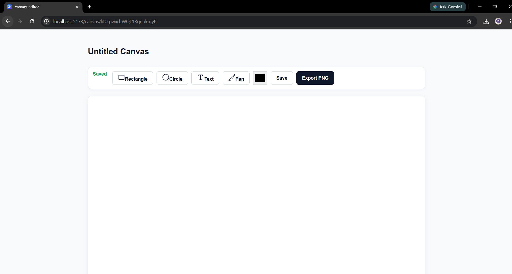
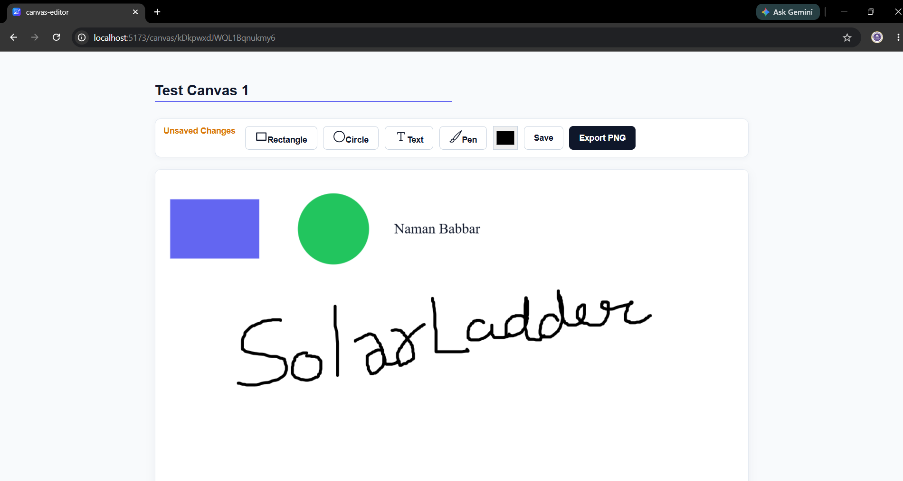
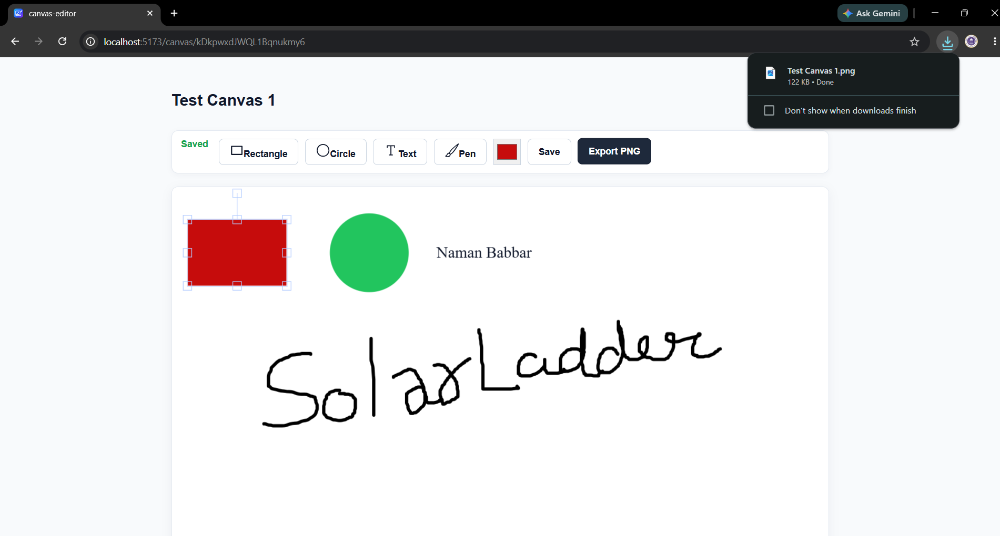
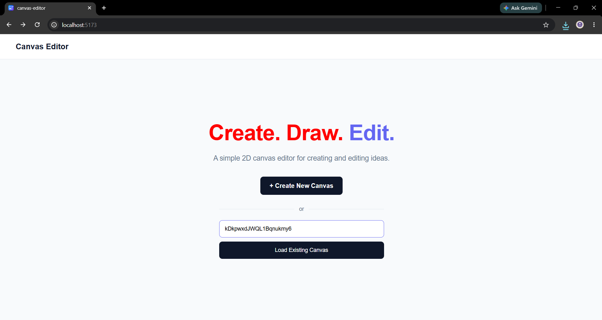

# 🎨 2D Canvas Editor

A simple web-based 2D canvas editor built with **React, Fabric.js, and Firebase Firestore**.

I built this project as part of an SDE internship assignment. The goal was to create a small editor where users can create a canvas, add and edit objects, draw freely, and save their work for later.

The editor allows users to create a canvas, add different types of objects, edit and manipulate them, draw freely, and save their work. Each canvas has its own URL, so a saved canvas can be opened again using the same link.

## ✨ Features

- Create a new canvas
- Unique URL for every canvas
- Load an existing canvas using its Canvas ID or URL
- Rename canvas
- Rectangle tool
- Circle tool
- Text tool
- Pen / freehand drawing tool
- Select and manipulate objects
- Move, resize, and rotate objects
- Edit text directly on the canvas
- Change object colors
- Delete selected objects
- Select all objects with `Ctrl + A`
- Save canvas state to Firebase Firestore
- Restore saved canvas state after refreshing
- Export canvas as PNG
- `Ctrl + S` keyboard shortcut
- Saved / Unsaved Changes / Saving status
- Loading state while opening a canvas
- Error handling for invalid canvas URLs

Authentication is not implemented because it was not required for the assignment.

---

## 🛠️ Tech Stack

| Technology | Purpose |
|------------|---------|
| React | UI and application logic |
| Vite | Development and build tooling |
| Fabric.js | Canvas rendering and object manipulation |
| Firebase | Backend services |
| Cloud Firestore | Canvas persistence |
| React Router | URL-based canvas routing |
| React Icons | Toolbar icons |
| Vercel | Deployment |

---

## 🏗️ How It Works

The application has two main routes:

```text
/
└── Home
    └── Create New Canvas

/canvas/:canvasId
└── Canvas Editor
```

The Home page creates a new Firestore document and uses the generated document ID as the canvas ID.

For example:

```text
/canvas/abc123xyz
```

When this URL is opened, the application retrieves the corresponding canvas from Firestore and loads it into Fabric.js.

An existing canvas can also be opened from the Home page by entering its Canvas ID or a canvas URL.

Once inside the editor, the canvas can be renamed and exported as PNG in addition to the core editing and persistence features.


```text
Home Page
    │
    ▼
Create New Canvas
    │
    ▼
Create Firestore Document
    │
    ▼
Get Document ID
    │
    ▼
/canvas/:canvasId
    │
    ▼
Canvas Editor
    │
    ├── Add Objects
    ├── Edit Objects
    ├── Draw
    ├── Change Colors
    ├── Rename Canvas
    ├── Export PNG
    │
    ▼
Save Canvas
    │
    ▼
Firestore
```

---

## 💾 Canvas Persistence

The canvas state is stored in Firebase Firestore.

Fabric.js provides the canvas data through `toJSON()`. Before storing it in Firestore, the data is converted into a JSON string.

```js
const canvasData = JSON.stringify(canvas.toJSON());
```

The saved data is then stored in the corresponding canvas document along with an update timestamp.

When the canvas is opened again, the stored string is parsed and loaded back into Fabric.js.

```text
Fabric.js Canvas
       │
       ▼
    toJSON()
       │
       ▼
JSON.stringify()
       │
       ▼
   Firestore
       │
       ▼
 JSON.parse()
       │
       ▼
loadFromJSON()
       │
       ▼
Restored Canvas
```

### Firestore Structure

Canvas documents are stored in the `canvases` collection.

```text
canvases/
└── {canvasId}
    ├── name
    ├── data
    ├── createdAt
    └── updatedAt
```

The Firestore document ID is used as the `canvasId` in the application URL.

---

## ⌨️ Keyboard Shortcuts

| Shortcut | Action |
|----------|--------|
| `Ctrl + A` | Select all objects |
| `Ctrl + S` | Save canvas |
| `Delete` | Delete selected objects |
| Double-click text | Edit text |

`Backspace` is intentionally left available for normal text editing.

---

## 📁 Project Structure

```text
canvas-editor/
├── public/
├── src/
│   ├── pages/
│   │   ├── Home.jsx
│   │   ├── Canvas.jsx
│   │   └── Canvas.css
│   ├── App.jsx
│   ├── App.css
│   ├── firebase.js
│   ├── index.css
│   └── main.jsx
├── .gitignore
├── eslint.config.js
├── index.html
├── package.json
├── package-lock.json
├── vercel.json
├── vite.config.js
└── README.md
```

---

## 🧠 Implementation Details

### Fabric.js and React

I use `useRef` to keep a reference to the Fabric.js canvas instance. This lets me work with the same canvas instance without putting it into React state.


I use `useEffect` for the canvas lifecycle:

- Create the canvas
- Load saved canvas data
- Register event listeners
- Register keyboard shortcuts
- Clean up the Fabric.js instance when the component is unmounted

### Object Manipulation

Fabric.js handles the interaction with canvas objects.

Objects can be selected and manipulated directly on the canvas, including:

- Moving
- Scaling
- Rotating
- Editing text

### Drawing

The Pen tool uses Fabric.js's `PencilBrush`.

The brush is initialized when required:

```js
if (!canvas.freeDrawingBrush) {
  canvas.freeDrawingBrush = new PencilBrush(canvas);
}
```

The drawing mode can then be toggled through the toolbar.

### Save Status

The editor keeps track of the current save state:

```text
Saved
Unsaved Changes
Saving...
```

A save version counter is used when saving. This prevents the UI from incorrectly showing `Saved` if the user makes another change while a previous save request is still in progress.

### Canvas Rename

The canvas name is stored in the `name` field of the corresponding Firestore document.

When the user edits the canvas name, the updated value is written back to Firestore. The name is also loaded when the canvas is opened so it persists across refreshes and future visits.

### Loading an Existing Canvas

The Home page provides an option to load an existing canvas using either its Canvas ID or its full canvas URL.

The application extracts the canvas ID and navigates to `/canvas/:canvasId`. The Canvas page then retrieves the corresponding document from Firestore.

### Canvas Export

The editor supports exporting the current canvas as PNG.

For PNG export, Fabric.js converts the current canvas into an image data URL which is then downloaded by the browser.


---

## 🐛 Challenges & Solutions

While building the editor, I encountered a few issues during development. Here are some of the main challenges I faced and how I solved them.

### 1. Storing Fabric.js Data in Firestore

Initially, I tried passing the Fabric.js canvas data directly to Firestore. This caused errors because some of the nested values were not suitable for Firestore.

I solved this by serializing the canvas data into a JSON string before saving it:

```js
JSON.stringify(canvas.toJSON())
```

When loading the canvas, I parse the JSON string again and restore the canvas state.

---

### 2. Freehand Drawing Brush

Initially, the Pen tool did not work reliably because a drawing brush was not always available on the Fabric.js canvas.

I fixed this by explicitly creating a `PencilBrush` whenever it was needed, ensuring that the freehand drawing functionality was consistently available.

---

### 3. Async Canvas Loading and React Strict Mode

While developing the application, I encountered errors when asynchronous Firestore loading completed after the Fabric.js canvas had already been disposed.

This happened because the asynchronous operation was still trying to interact with a canvas that no longer existed.

I resolved this by adding an `isDisposed` check so that asynchronous operations stop updating the canvas after the component has been unmounted or the canvas has been disposed.

---

### 4. Loading and Error UI

Initially, I placed the loading and error UI elements inside the area managed by Fabric.js.

This caused rendering and interaction issues because Fabric.js manages the canvas element and its surrounding rendering behavior.

I resolved this by separating the application UI from the Fabric.js-managed canvas. Fabric.js is now responsible only for the actual canvas, while React handles the loading and error states separately.

---

### 5. Vercel Build

During my first production deployment, the Vercel build revealed that some runtime dependencies were missing from `package.json`.

I added the required dependencies and verified the production build locally using:

```bash
npm run build
```

After confirming that the build completed successfully, I redeployed the application to Vercel.

---

### 6. React Router and Vercel

My application uses client-side routing for URLs such as:

```text
/canvas/abc123
```

Initially, refreshing one of these URLs resulted in a Vercel 404 because Vercel was trying to resolve the path as a server-side route instead of allowing React Router to handle it.

I resolved this by adding a rewrite rule in `vercel.json` so that all application routes are served through the React application:

```json
{
  "rewrites": [
    {
      "source": "/(.*)",
      "destination": "/index.html"
    }
  ]
}
```

This allowed React Router to correctly handle routes such as `/canvas/abc123`, including when the page is refreshed directly.


---

## 🚀 Getting Started

### Prerequisites

Make sure you have:

- Node.js
- npm
- A Firebase project
- Cloud Firestore enabled in the Firebase project

### 1. Clone the repository

```bash
git clone https://github.com/NamanBabbar2701/2D-Canvas-Editor.git
cd 2D-Canvas-Editor/canvas-editor
```

### 2. Install dependencies

```bash
npm install
```

### 3. Configure Firebase

The application uses Firebase Firestore for canvas persistence.

Firebase configuration is maintained in:

```text
src/firebase.js
```

Create a Firebase project, enable Cloud Firestore, and configure the application with your Firebase project details.

### 4. Start the development server

```bash
npm run dev
```

Vite will display the local development URL in the terminal.

### 5. Create a production build

```bash
npm run build
```

---

## 🔥 Firebase Configuration

The application uses Cloud Firestore to store canvas documents.

The main Firestore collection used by the application is:

```text
canvases
```

Each newly created canvas receives a unique Firestore document ID.

That ID is then used in the route:

```text
/canvas/:canvasId
```


---

## 📸 Screenshots

Screenshots can be added here as the project documentation is finalized.

### Home Page


### Canvas Editor



### Renaming Canvas



### Saved Canvas


### Export Canvas



### Load Existing Canvas



---

## 🌐 Live Demo

The application is deployed on Vercel:

**[Open 2D Canvas Editor](https://2-d-canvas-editor-rho.vercel.app/)**

A simple way to test persistence:

```text
Create New Canvas
       ↓
Add / edit objects
       ↓
Click Save
       ↓
Refresh the page
       ↓
Saved canvas is restored
```

---


## 📌 Project Status

**Completed**

The required functionality for the assignment has been implemented, tested, and deployed.

Additional features including canvas renaming, loading existing canvases, and exporting canvases as PNG have also been implemented.

---

## 👨‍💻 Author

**Naman Babbar**

[GitHub](https://github.com/NamanBabbar2701)